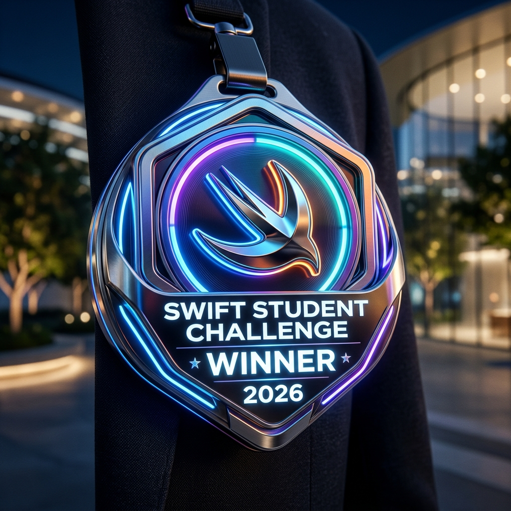

<div align="center">
  
  <h1>AXIS</h1>
  <p><strong>Winner of the Apple Swift Student Challenge 2026 🏆</strong></p>
  <p><i>A privacy-first, intelligent posture coaching app powered by AirPods motion tracking.</i></p>
</div>

<br>

## 🌟 Overview

**AXIS** is an iOS application designed to help users improve their neck posture and combat "tech neck" using real-time head-pose tracking. By leveraging the spatial sensors in AirPods, AXIS provides interactive, highly-accurate motion guidance without ever needing access to your camera. 

The app features a beautifully crafted, calm aesthetic designed to keep users mindful of their posture in a non-intrusive way.

---

## ✨ Key Features

- **🎧 Real-Time Motion Tracking:** Uses `CMHeadphoneMotionManager` to read pitch, yaw, and roll data directly from your AirPods.
- **🗣️ Audio Coaching:** Hands-free guidance using `AVFoundation` for synthetic speech cues.
- **📈 Progress Tracking:** Persistent storage of your posture alignment scores and daily sessions using `SwiftData`.
- **📳 Haptic Feedback:** Tactile guidance for posture corrections and milestone achievements.
- **🔒 Privacy First:** All motion processing happens entirely on-device. No camera or internet connection needed.

---

## 🛠️ Technologies & Frameworks

Built entirely with Apple's modern frameworks for iOS 26:

* **SwiftUI** - For a fluid, reactive, and breathtaking user interface.
* **CoreMotion** - To interact with AirPods sensors for multi-axis tracking.
* **SwiftData** - For seamless, safe on-device data persistence.
* **AVFoundation** - For generating on-the-fly audio coaching cues.

---

## 🚀 Getting Started

### Prerequisites
- Xcode 18.0 or later
- iOS 26.0+ Device (or Simulator with iOS 26)
- A pair of AirPods (Pro, Max, or 3rd Gen+) for live motion tracking

### Installation
1. Clone the repository:
   ```bash
   git clone https://github.com/Shoryamishra61/AXIS.git
   ```
2. Open `AXIS.swiftpm` in Xcode or swift playgrounds.
3. Build and run on your physical device. Ensure your AirPods are connected!

*Note: If no AirPods are detected, the app gracefully falls back to a simulated motion demo mode so you can still experience the UI and coaching flows.*

---

## 👨‍💻 About The Developer

Created by **Shoryakumar Mishra** for the Swift Student Challenge 2026. 

[](https://www.linkedin.com/in/shoryakumar-mishra/)

---
<div align="center">
  <p>Made with ❤️ in Swift</p>
</div>
